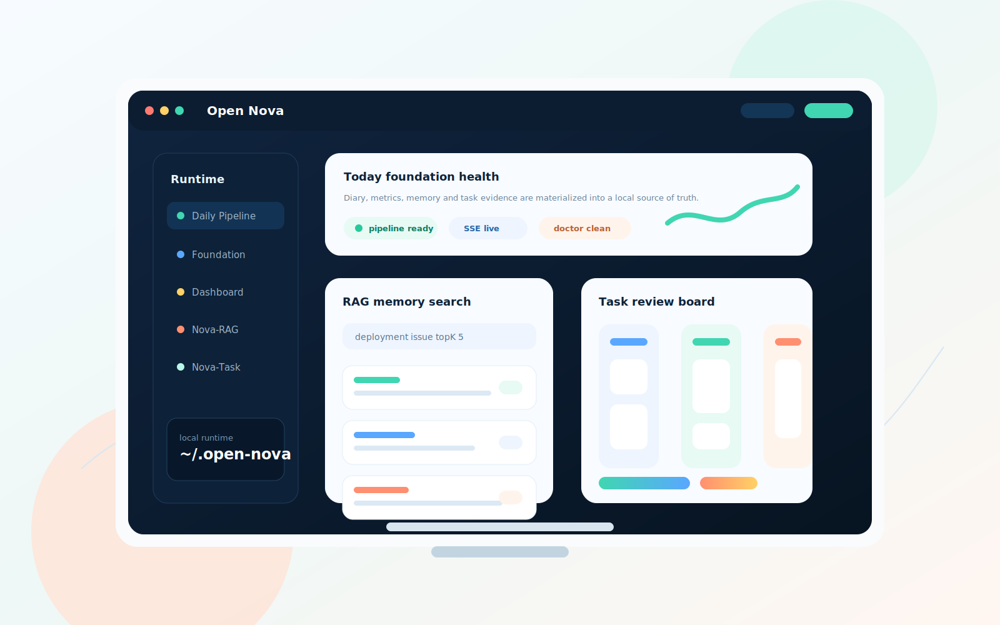

<div align="center">


### Share memory across independent agent runtimes and turn siloed activity into searchable, reusable local AI assets.

**Fully Automated AI Asset Operations · Memory Sharing Across Agent Runtimes · LLM-Engaged Workflows**

[](https://neo-isshin.github.io/open-nova/)
[](https://raw.githubusercontent.com/Neo-Isshin/open-nova/v1.0.0/install/bootstrap.sh)
[](https://neo-isshin.github.io/open-nova/)
[](README.zh-CN.md)
[](README.md)
[](https://discord.gg/JvJHngZWz)

[Website](https://neo-isshin.github.io/open-nova/) · [Complete Operations Runbook](docs/local-operations-runbook.md) · [External Agent Runtime Contract](docs/rag-external-agent-contract.md) · [中文 README](README.zh-CN.md)

</div>

Open Nova is a highly automated, structured, and non-invasive local AI asset operations system. It is an **LLM-engaged system**: LLMs participate throughout summarization, task synthesis, learning extraction, and knowledge organization, while deterministic components retain control over collection, parsing, attribution, scheduling, persistence, and security boundaries.

In this README, an **agent runtime** means an independent AI tool environment—such as Codex, Claude Code, Gemini CLI, OpenClaw, or Hermes—with its own sessions, logs, memory, and execution context.

Open Nova is ideal for people who want to:

- 🤖 **Share memory across agent runtimes:** Turn sessions, tasks, and notes from independent runtimes into structured, searchable evidence, so each runtime can build on work completed elsewhere.
- 📓 **Automate task recognition and persistence** (Beta): Extract candidate tasks and deliverables from daily activity, then organize and present them through a unified task board for review.
- 🌍 **Generate automated summaries in a single-pane-of-glass Dashboard:** Review daily, weekly, and monthly summaries in one place and follow how your work with AI evolves over time.
- 📖 **Learn alongside your agents:** Capture challenges, solutions, and practical recommendations as a growing personal knowledge base.
- 🚉 **Manage supported runtimes in one place:** Monitor real-time and lifetime activity, and inspect or edit each runtime's `SKILL.md` files directly.

## 🌟 Why Open Nova

A single user may work with several independent agent runtimes—including `Codex`, `Claude Code`, `Gemini CLI`, `OpenClaw`, and `Hermes`—within the same week or even the same project. Each tool produces its own siloed logs, sessions, skills, memory, token metrics, and task history.

Open Nova breaks down those silos. It allows `Codex` to reuse context captured from `Claude Code`, consolidates fragmented activity into polished reports and dashboards, and preserves tangible deliverables, resolved obstacles, and debugging evidence as durable local assets.

| Capability | Description |
| :--- | :--- |
| **Automated Pipeline** | Ingests raw activity from supported agent runtimes, then cleans, parses, analyzes, structures, and persists recognized assets into a local data store. |
| **AI Asset Persistence Layer** | Normalizes supported tool logs, sessions, usage events, tasks, reports, and generated diaries in the local `Foundation` system. |
| **Automatic Workspace Attribution** | Associates activity with the correct workspaces, runtimes, scheduled jobs, and source repositories—even when work starts outside the project directory. |
| **Smart Task Management** | Extracts candidate task details, evidence, status, and review context from runtime activity, then lets `Nova-Task` organize and present them for review. |
| **Built-in `nova-RAG`** | Provides an optimized local RAG engine and a secure, read-only search contract for external runtimes, enabling cross-runtime memory retrieval. |
| **Comprehensive Settings Hub** | Provides one interface for time zones, pipeline execution, LLM preferences, external tool paths, and RAG settings. |

## 💫 Key Advantages

- **Parser-first processing:** Source-specific parsers normalize sessions, tasks, usage records, scheduled-job activity, reports, and workspace signals before routing them into summarization, task-evidence, or RAG indexing workflows.
- **Non-invasive runtime:** Open Nova reads configured tool directories and writes to its own runtime home without taking over your agent runtimes, shell, editor, or model gateway.
- **Reliable background attribution:** Context is not limited to the active terminal directory. Scheduled jobs, background scripts, and out-of-directory runtime activity can still be mapped to the correct workspace through execution evidence.
- **Evidence-backed task history:** `Nova-Task` turns observed runtime activity into a reviewable task record, not only analyzing conversation but also evaluating tool results to determine work completion. This ensures the task board reflects actual work performed, reducing the need for manual tracking.
- **Model-efficient by design:** Structured prompts, strict schemas, and optimized orchestration allow lightweight or cost-efficient models to produce useful results without locking the system to a premium model.
- **User-controlled integrations:** Tool-specific skills and external-runtime integration definitions remain transparent, editable, and auditable from the Dashboard.
- **Agentic RAG capabilities:** `nova-RAG` provides a local search facade for external runtimes and manages retrieval quality through evaluation queries, candidate promotion, and safe rollback paths.
- **Local-first and personal:** Runtime state and generated assets remain under your control. Calls to configured LLM or embedding providers use the endpoints and policies you select.

## 💻 System Components

| Subsystem / Module | Role and core function |
| :--- | :--- |
| **`Foundation`** | The local source of truth for normalized AI activity, workspace mappings, snapshots, reports, task evidence, and repair audit records. |
| **`Dashboard`** | A single-pane-of-glass web interface for diaries, AI metrics, token usage, settings, Foundation operations, background tasks, and task boards. |
| **`base-pipeline`** | The orchestration engine that processes runtime logs into daily diaries, technical milestones, learning notes, and task summaries. |
| **`nova-RAG`** | A self-contained Agentic RAG service with local or cloud embeddings, calibrated retrieval, external read-only APIs, and a guarded index lifecycle. |
| **`Nova-Task`** | An LLM-assisted task system and review surface for evidence derived from real work. |
| **`Attribution Parser`** | Identifies and classifies workspaces, agent runtimes, sessions, scheduled jobs, usage records, and execution evidence. |
| **`Installer`** | Handles dry-run installation plans, dependency resolution, runtime bootstrapping, macOS `LaunchAgent` registration, Doctor diagnostics, and updates. |

Open Nova currently supports path families for `OpenClaw`, `Claude Code`, `Codex`, `Gemini CLI`, and `Hermes`. These integrations remain user-owned configuration and do not take over your global toolchain.

## 💽 Prerequisites

Open Nova is currently optimized for local macOS environments:

- 🍎 **Native macOS support:** The guided installer and managed scheduler use macOS `LaunchAgent` services by default.
- 🐍 **Python environment:** Python `>= 3.11` is required; Python `3.12` is recommended.
- 📦 **Automatic dependency installation:** The installer detects and installs missing requirements. Dashboard and local `nova-RAG` embeddings require additional Python packages; the first setup may download larger libraries such as `torch` and `sentence-transformers`.
- 🐧 **Linux and Windows compatibility:** These platforms are not first-class one-liner targets in v1.0.0. Advanced users can check out the source and run individual components manually; the supported managed Runtime and service workflow targets macOS.
- ⚙️ **System utilities:** Make sure `git`, `curl`, and a compatible `python3` are available on `PATH` before running the installer.

**Open Nova currently supports five agent runtimes:**<br>
🦞 `OpenClaw`, ✳️ `Claude Code`, 🤖 `Codex`, ✨ `Gemini CLI`, and ⚕️ `Hermes`.

More runtimes are planned for the next major version, including `Cursor`, `Antigravity`, and `OpenCode`.

## 🎥 Quick Start

> [!TIP]
> **Deploy with a single command, then let the system handle the rest.**

### 1. One-command Installation

Run the hosted bootstrap script in your terminal:

```bash
zsh -c "$(curl -fsSL 'https://raw.githubusercontent.com/Neo-Isshin/open-nova/v1.0.0/install/bootstrap.sh')"
```

The hosted bootstrap is fresh-install-only. It resolves the latest stable
GitHub Release to its full commit before acquiring source, and fails closed
when no stable Release exists. If any Open Nova Runtime or managed LaunchAgent
already exists, use `open-nova update --dry-run` followed by
`open-nova update --apply` instead. The versioned `v1.0.0` URL above is the
immutable installation entry for this release and never tracks `main`.

> [!NOTE]
> The installer guides you through LLM provider setup and stores provider keys in the runtime-local secret store at `$NOVA_HOME/state/secrets` (directory mode `0700`, secret-file mode `0600`). It works unattended and requires no Keychain setup or recurring authorization. `nova-RAG` is optional; a cloud embedding key, when configured, uses the same secret store.
>
> Existing `macos-keychain` references are supported only for compatibility migration. If an old Keychain item cannot be read, enter that provider key once in Dashboard; Open Nova does not automatically delete the old Keychain item.

### 2. Basic Verification

Run these read-only commands after installation:

```bash
open-nova doctor
open-nova model show
open-nova onboard status
open-nova config show
```

The installation summary shows the active Dashboard URL. The default is `http://127.0.0.1:3036/dashboard`; if the port is occupied, use the automatically selected URL from the summary.

## 🧭 Onboarding: First-Run Guide

### 1. Open the Dashboard

Open the URL shown in the installation summary. Confirm that the page loads, then check the background-task and message indicators in the upper-right corner.

### 2. Configure and Test the LLM Provider

Open Settings and verify the Provider, Endpoint, Model, and API key. Run the availability test before saving. Narrative diaries, period summaries, and history tasks that require an LLM use this configuration.

### 3. Generate the First Set of Historical Data

1. Select **Generate Historical Data** in the Dashboard and choose the date range to complete.
2. Select **Preview Plan** first. Review the pending diaries, weekly and monthly reports, estimated LLM calls, and `nova-RAG` synchronization tasks.
3. Clear any tasks you do not want to run, then select **Queue Generation**.
4. Open Nova runs only the selected tasks. `nova-RAG` tasks run only when the subsystem is enabled and ready.

> [!NOTE]
> History generation runs in the background. Large date ranges may take time; blank dates may produce structured placeholder artifacts without calling an LLM.

### 4. Monitor Progress and Results

Use **Background Tasks** and **Messages** to inspect queued, running, failed, and retryable work. After completion, refresh Diary, AI Assets, Nova-Task, and `nova-RAG`. Failed items can be retried from the task or message surface.

### 5. Complete Onboarding

- [ ] Dashboard opens successfully;
- [ ] LLM provider test passes and the settings are saved;
- [ ] `open-nova doctor` reports no blocking errors;
- [ ] The history plan and selected tasks are correct;
- [ ] The first tasks have completed or are observable in the background;
- [ ] Diary and AI Assets contain data;
- [ ] Nova-Task contains task evidence;
- [ ] When `nova-RAG` is enabled, the Server and active index are ready.

For the complete first-run, daily operations, scheduling, update, and troubleshooting workflow, see the [Local Operations Runbook](docs/local-operations-runbook.md).

## 📂 Runtime Layout

Open Nova stores its state in local, user-owned paths:

| Path | Description |
| :--- | :--- |
| **`~/.open-nova`** | Main runtime home |
| **`~/.config/open-nova/location.json`** | Pointer to the active runtime location |
| **`~/.open-nova/state/secrets`** | Runtime-local LLM and optional cloud-embedding provider keys |
| **`~/.open-nova/artifacts/diary`** | Generated diaries and summaries |
| **`~/.open-nova/bin/open-nova`** | CLI shim executable |

The installer also creates the user-facing shim at `~/.local/bin/open-nova`. Use `--no-shell-path` to leave shell profiles unchanged, or `--shell-path-file /path/to/profile` to select the profile file explicitly.

> [!WARNING]
> Runtime databases, generated diaries, logs, temporary caches, local `LaunchAgent` artifacts, and secret-bearing configuration files must remain untracked and must not be committed.

## 🔧 Base Pipeline

- On macOS, the installer registers managed user LaunchAgents under `~/Library/LaunchAgents/`.
- The Pipeline reads configured external-tool paths and attributes activity to workspaces using observed tool evidence.
- Check managed scheduling with `open-nova doctor --scheduler`.
- Run a specific business date manually with `open-nova pipeline [YYYY-MM-DD]`.
- Before scheduling through an external agent runtime, prevent duplicate execution with the managed system schedule. The Dashboard Settings page provides a reusable scheduling prompt.

## 📊 Dashboard

The `Dashboard` is a locally hosted FastAPI web application. Its default URL is:

```text
http://127.0.0.1:3036/dashboard
```

> [!NOTE]
> If port `3036` is already in use, the installer automatically selects another available port. Use the URL displayed in the installation summary.

Dashboard highlights include:

- 📅 **Daily and period diaries:** Browse generated Narrative, Technical, and Learning records.
- 📈 **Live overview and AI asset metrics:** Track usage and asset-growth statistics.
- 🔧 **Foundation operations and Daily QA:** Run consistency checks and repair data.
- ✉️ **Background tasks and messages:** Monitor resident processes and execution status.
- ⚙️ **Settings and preferences:** Configure LLM providers, schedules, runtime state, and external tool paths.
- 📋 **Nova-Task board:** Review and validate tasks backed by real runtime evidence.
- 🔍 **RAG console:** Run semantic searches and inspect retrieval quality when RAG is enabled.

### 🖼️ Interface Preview

The local Dashboard is Open Nova's primary control surface. A privacy-safe,
fully synthetic interactive preview is available on the
[public release page](https://neo-isshin.github.io/open-nova/) and is also
bundled at [docs/dashboard-demo/index.html](docs/dashboard-demo/index.html).
It uses generated sample data and never connects to a local Open Nova Runtime.

<p align="center">
  <a href="https://neo-isshin.github.io/open-nova/">
    
  </a>
</p>

## ⚙️ Nova-Task System

Nova-Task is designed for collaboration between automated maintenance and human control. A user can take over at any time or let Nova-Task maintain ordinary task structure automatically.

In automatic mode, Nova-Task can recognize task hierarchy, update state, attach child tasks, and refine the task tree. High-impact top-level changes remain subject to human review, while routine second- and third-level task updates can proceed autonomously.

Nova-Task aims to become a **real-work graph**: a record of engineering work that actually happened rather than a list of intended work. This distinction matters in AI-assisted development, where useful work often grows from investigation, debugging, experiments, rollback, and validation instead of starting from a formal ticket.

Nova-Task also tracks task state and evolves existing work graphs. When a user imports an RFC, PRD, Roadmap, or Audit, an LLM can decompose the document into a Nova-Task-compatible task tree for iterative review and maintenance.

## 🤖 External Agent Runtime Boundary for nova-RAG

`nova-RAG` exposes a secure, read-only interface that allows external agent runtimes to query your personal memory index. External runtimes are **strictly prohibited** from writing memories, modifying indexes or global settings, or controlling the service lifecycle. Retrieval quality is managed through evaluation queries, candidate promotion, and safe rollback paths.

`nova-RAG` improves retrieval at both the **server** and **client skill** layers:

- **Server-side Agentic:** Deterministic, low-cost, baseline-first, adaptive retrieval passes.
- **Skill-side Agentic:** Uses the external runtime's own LLM to reflect only when the server reports weak or ambiguous evidence.

#### 1. Preferred Dashboard Facade API (default base URL: `http://127.0.0.1:3036`)

External runtimes should use this read-only facade whenever possible:

```text
GET  /api/rag/external/health    # Check API health
GET  /api/rag/external/stats     # Inspect index and retrieval statistics
GET  /api/rag/external/contract  # View the active integration contract
POST /api/rag/external/search    # Search semantic memory
```

#### 2. Direct nova-RAG Service API (default base URL: `http://127.0.0.1:3037`)

Use these endpoints for direct, read-only integrations:

```text
GET  /health                     # Check service health
GET  /stats                      # Inspect index status
POST /search                     # Search memory directly
```

> [!IMPORTANT]
> - Host and port values come from the active runtime settings. `POST /encode` is reserved for internal embedding computation and is not part of the external-runtime contract.
> - The external API namespace rejects all state-changing requests, including writing memories, adding sources, rebuilding indexes, modifying settings, and starting or stopping services. See the [External Agent Runtime Contract](docs/rag-external-agent-contract.md) for details.

## 📐 Development and Testing

To develop or test Open Nova locally, create an editable installation:

### 1. Set Up a Local Development Environment

```bash
# Create and activate a virtual environment
python3 -m venv .venv
source .venv/bin/activate

# Upgrade pip and install the package in editable mode
python -m pip install --upgrade pip
python -m pip install -e ".[dashboard,rag-local]"
```

### 2. Run Unit Tests

```bash
# Run the release suite in a disposable venv, HOME, NOVA_HOME, and fixed business clock
python tests/run_isolated_release_suite.py
```

For a targeted test inside an already prepared development environment, use
`python -m unittest tests.test_module.TestClass.test_name`.

### 3. Run UI and End-to-End Tests

If Node.js is available, run the static JavaScript check and Playwright test suite:

```bash
# Install the locked Node dependencies
npm ci

# Verify JavaScript syntax
node --check src/dashboard/app/static/js/app.js

# Run the deterministic Release Page and Dashboard-context tests
npm run test:dashboard-live-context
npm run test:release-page
```

> [!NOTE]
> The real Dashboard gate is opt-in and destructive. Run
> `npm run test:dashboard-live` only against a seeded disposable Runtime with
> `OPEN_NOVA_DASHBOARD_LIVE_BASE_URL` set to its loopback URL. Generated
> databases, Runtime logs, temporary files, evidence, and local secret-store
> data must remain untracked and must not be committed.

## 📄 Related Documentation

- 📖 [New User Onboarding Guide](docs/new-user-onboarding-runbook.md)
- ⚙️ [Complete Local Operations Runbook](docs/local-operations-runbook.md)
- 🧭 [CLI Product Boundary](docs/cli-boundary.md)
- 🤖 [External Agent Runtime Contract](docs/rag-external-agent-contract.md)
- 🧩 [Nova-Task Work Graph Reconciliation](docs/nova-task-work-graph-reconciliation.md)
- 🧹 [Production-clean Inventory](docs/production-clean-inventory.md)
- ✅ [v1.0.0 Release Assurance](docs/v1-release-assurance.md)
- 🌐 [Modern Release Page](https://neo-isshin.github.io/open-nova/)
- 🧾 [Changelog](CHANGELOG.md)
- 🔐 [Security Policy](SECURITY.md)
- 🕰️ [Public Project History](HISTORY.md)

## ⚖️ License

Copyright © 2026 Neo-Isshin.

Open Nova is free software licensed under the [GNU General Public License version 3 or any later version](LICENSE), identified by the SPDX expression `GPL-3.0-or-later`.

## 🙏 Acknowledgements

Open Nova is made possible by the vibrant ecosystem of AI coding tools and their open-source communities. We are grateful that these tools store token-usage and activity data in local logs, making unified visualization and asset consolidation possible.

Special thanks to the [getdesign.md](https://getdesign.md) community for inspiring the layout and visual direction of the Dashboard.
