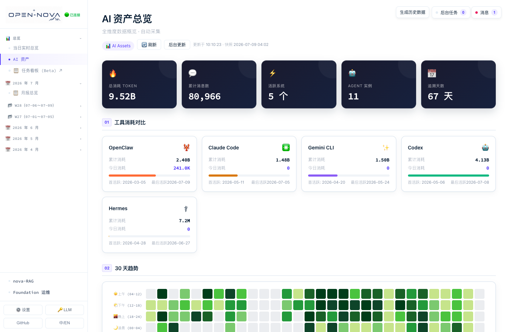
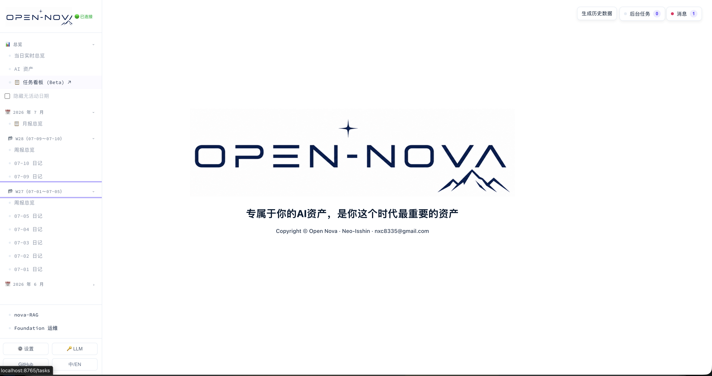
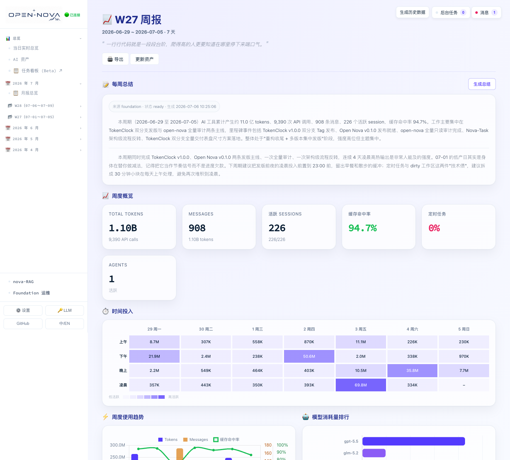
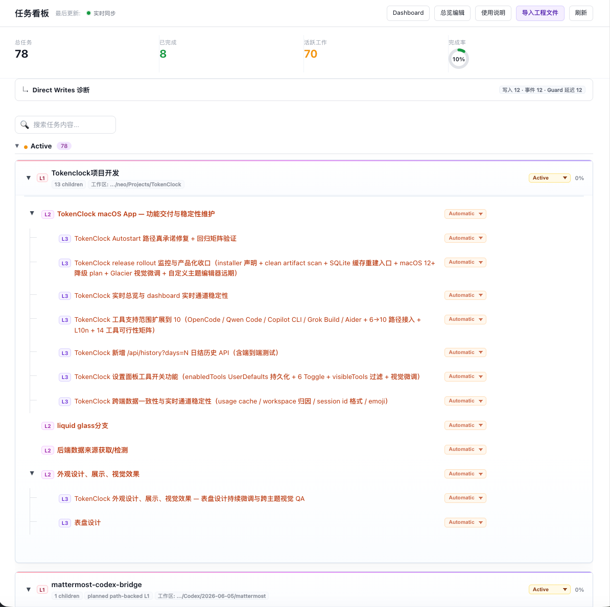
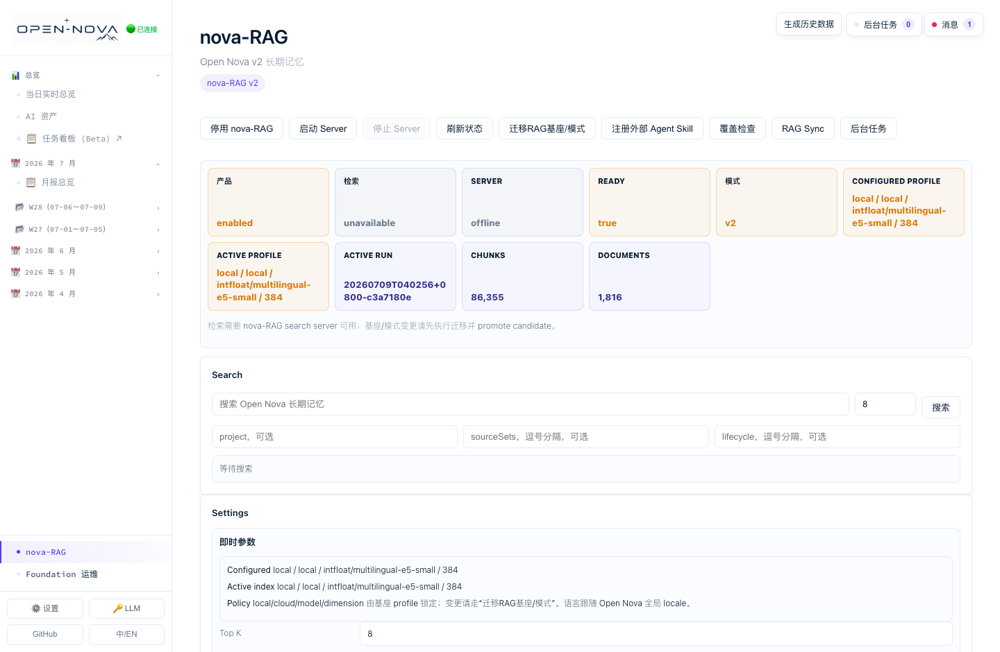

<h1 align="center">
  
</h1>

<p align="center">
  <strong>Agent 完成了有价值的工作——Actanara 让这些成果不再随 Session 消失。</strong>
  <br>
  把 Codex、Claude Code、Gemini CLI、OpenClaw 和 Hermes 的会话、任务与证据，留成你能查、能复用、能回顾的本地资产。
</p>

<p align="center">
  
  <a href="README.md"></a>
</p>

<p align="center">
  <a href="https://neo-isshin.github.io/actanara/"></a>
  <a href="https://github.com/Neo-Isshin/actanara/releases/latest"></a>
  <a href="https://neo-isshin.github.io/actanara/dashboard-demo/"></a>
  <a href="#linux-support"></a>
  <a href="LICENSE"></a>
  <a href="https://discord.gg/JvJHngZWz"></a>
</p>

<p align="center">
  <a href="https://neo-isshin.github.io/actanara/dashboard-demo/"><strong>体验在线 Dashboard</strong></a> ·
  <a href="#install-actanara"><strong>安装 Actanara</strong></a> ·
  <a href="#linux-support"><strong>Linux 支持</strong></a> ·
  <a href="docs/local-operations-runbook.zh-CN.md">中文操作 Runbook</a>
</p>

<p align="center">
  <a href="https://neo-isshin.github.io/actanara/dashboard-demo/">
    
  </a>
</p>

<p align="center"><sub><b>真实本地 Dashboard</b> · 点击图片进入在线交互 Demo</sub></p>

## Actanara 能为你留下什么

同一个项目里，你可能在一天之内轮换使用 Codex、Claude Code、Gemini CLI 等多个 Agent 工具。每个工具都真实记录了你的工作，却彼此隔离——会话一结束，排查、决策和成果就很难再找回来。

Actanara 打通这些壁垒：让 Claude Code 完成的工作能被 Codex 找到并复用，让零散 Session 变成可长期回顾的进展，让任务成果和调试证据不再随会话消失。

| | 结果 |
| :--- | :--- |
| **跨 Agent 共享记忆** | 受限的只读检索边界，让一个 Runtime 能找到并复用另一个 Runtime 已完成的工作。 |
| **真实发生过的工作图谱** | `Nova-Task` 从对话、文件变更和工具结果中提取任务、状态与证据，而不是只依赖手写工单。 |
| **自动生成的工作叙事** | 日报、周报和月报，把零散 Session 变成可回顾的进展、决策与经验。 |
| **本地事实来源** | Session、用量、生成资产和任务证据保存在你掌控的本地存储中，集成边界清晰可见。 |

**设计取舍**

- **解析器优先**：先把不同 Runtime 的会话、任务、用量和工作区信号标准化，再交给 LLM 总结或检索，而不是把原始日志直接喂给模型。
- **本地优先、边界清晰**：Actanara 只读取已配置的工具位置，把数据写入自己的 Runtime Home，不改写外部 Runtime 的历史，也不接管其执行。
- **模型成本友好**：结构化提示词、明确 Schema 和可控编排，让轻量模型也能产出可用结果，同时不锁定单一 Provider。
- **集成由用户控制**：工具 Skill、外部 Runtime 定义和关键设置都可查看、可编辑、可审计。
- **受保护的 Agentic RAG**：`nova-RAG` 通过查询评估、候选提升、召回校准和安全回滚管理检索质量，只向外部 Runtime 暴露受限的只读合约。

> 本文中的 **Agent Runtime** 指拥有独立会话、日志、记忆和执行上下文的 AI 工具环境，例如 Codex、Claude Code、Gemini CLI、OpenClaw 和 Hermes。

<a id="install-actanara"></a>
## 安装 Actanara

```bash
curl -fsSL https://raw.githubusercontent.com/Neo-Isshin/actanara/main/install/setup.sh | sh
```

这是 macOS 与 Linux 共用的公开入口，无需 `sudo`。它先把官方 `main`
解析为精确 commit，再分派到对应平台适配器。macOS 保持原有的引导式
全新安装与更新行为；Linux 支持受保护的全新安装、仅源码刷新、按锁升级，
以及经明确确认的已有 Runtime 修复。Linux 更新事务会保持原有 systemd
user unit 状态，遇到定义漂移或非 Actanara unit 时保守失败。第一次了解 Actanara？可以先体验
[在线 Dashboard Demo](https://neo-isshin.github.io/actanara/dashboard-demo/)，再决定是否安装。

Linux 公开入口发现已有 managed Runtime 时：存在控制终端会先展示固定到
精确 commit 的升级计划，再询问是否执行；没有控制终端则以状态码 2
退出、不改动 Runtime，并输出可直接复制的 `actanara update --dry-run` 与
`actanara update --apply` 精确命令，其中包含已解析的源码 URL、commit、
Runtime 与 installer cache。

稳定 CLI shim 为 `~/.actanara/bin/actanara`，默认还会建立
`~/.local/bin/actanara` 链接。macOS 可用 `--no-shell-path` 或
`--shell-path-file /path/to/profile` 控制受管理的 profile 区块；Linux 的
`--no-shell-path` 只禁止 user-bin 链接，安装器不会编辑 Shell profile。
高级源码选择使用 `--source-root PATH` 或精确 `--ref <full-commit-sha>`；
离线操作必须明确选择其中一种来源。

安装器写入路径以及 launchd/systemd 注册边界见
<a href="docs/local-operations-runbook.zh-CN.md">中文本地操作 Runbook</a>。

<a id="linux-support"></a>
## 🐧 Linux 支持

Actanara 为使用 `systemd --user` 的 Debian 类主机提供原生、非 root 的
Linux 路径，并不是 macOS 兼容层。当前发布门禁在 Debian 13 x86_64、
CPython 3.13 与 systemd 257 上执行；依赖锁也提供 arm64 目标，而真实主机
功能门禁覆盖的是 x86_64。

| 能力 | Linux 行为 |
| :--- | :--- |
| **安装与更新** | 公开 `setup.sh` 入口支持受保护的全新安装、精确 ref/仅源码更新、按锁依赖升级和显式修复。新 generation 先在 staging 中构建再原子提升；失败后旧 Runtime 仍可恢复。 |
| **用户边界与服务** | 请以普通登录用户运行 `setup.sh`，不要通过 `sudo` 启动。Actanara 自身不会调用 `sudo`；Dashboard、可选 `nova-RAG` 与调度任务使用由 `systemctl --user` 控制的用户级 systemd unit。 |
| **RAG readiness** | 全新安装可启用经审计的 CPU-only 本地 profile，使用 384 维的 `intfloat/multilingual-e5-small`。credential-backed Provider 尚未配置时，fresh managed cloud RAG 会保守拒绝。安装器只有在受管 listener、source commit、provider profile、模型与健康响应全部一致后才报告成功。 |
| **端口与无桌面主机** | Dashboard 与 RAG 默认只监听 loopback 的 3036 与 3037。无桌面主机应通过 SSH 转发已配置的 Dashboard 端口，并让本地端口保持一致，以满足浏览器 Origin 检查。 |
| **会话生命周期** | 非交互安装不会修改 systemd linger；只有显式选项或交互确认后才会请求 linger。 |

无桌面主机使用默认 Dashboard 端口时：

```bash
ssh -N -L 3036:127.0.0.1:3036 user@linux-host
# 然后在本机打开 http://127.0.0.1:3036/dashboard。
```

如果修改过 Dashboard 端口，tunnel 两端都应使用实际配置值。Linux 快速
健康检查：

```bash
actanara doctor --installer
actanara doctor --scheduler
actanara doctor --rag  # 启用 nova-RAG 时运行。
```

离线全新安装会在写入 release generation 前预检 Python/pip bootstrap 与
可信依赖缓存；缺少必要 bootstrap 材料时会无残留停止。Linux 使用所选的
系统 Python，不安装托管 Python Runtime。

## 🎥 快速开始

> [!TIP]
> 一行部署，然后静等繁荣。

### 1. 基础验证

安装完成后，先运行以下只读命令。它们不会初始化新 Runtime，也不会修改现有设置：

```bash
actanara doctor
actanara model show
actanara onboard status
actanara config show
```

`actanara doctor` 还支持定向诊断（`--installer` / `--pipeline` / `--scheduler` / `--rag`），细节见 Runbook。安装摘要会显示实际 Dashboard URL，默认 `http://127.0.0.1:3036/dashboard`。

### 2. 完成首次运行

1. **打开 Dashboard**：使用安装摘要中的 URL，检查右上角的后台任务与消息状态。
2. **配置 LLM Provider**：确认 Provider、Endpoint、Model 和 API Key，先做可用性测试，再保存设置。
3. **预览历史数据计划**：选择日期范围，检查待生成日记、周报、月报和预计 LLM 调用。
4. **排队执行**：取消不需要的任务，再将其余项目加入后台队列。
5. **查看结果**：在“后台任务”和“消息”中查看进度，完成后刷新日记、AI 资产、Nova-Task 和可选 `nova-RAG`。

<details>
<summary><strong>首次运行检查清单</strong></summary>

- [ ] Dashboard 可以正常打开。
- [ ] LLM Provider 检测通过并已保存。
- [ ] `actanara doctor` 没有阻断性错误。
- [ ] 历史数据计划与勾选任务符合预期。
- [ ] 首批任务已完成或可以在后台观察。
- [ ] 日记、AI 资产与 Nova-Task 已有内容。
- [ ] 启用 `nova-RAG` 时，Server 和活动索引已就绪。

</details>

完整的安装前检查、首次配置、历史回填、日常运维与故障排查，请参阅<a href="docs/local-operations-runbook.zh-CN.md">中文本地操作 Runbook</a>。

## 🧭 工作原理

```text
受支持的 Agent Runtime
        ↓
解析、归因与标准化
        ↓
Foundation 本地事实层
        ↓
Base Pipeline · Nova-Task · Dashboard
        ↓
nova-RAG（可选）→ 外部 Runtime 只读检索
```

| 系统 | 核心职责 |
| :--- | :--- |
| **`Foundation`** | 将 AI 活动、工作区归因、快照、报告和任务证据规范化到本地事实层。 |
| **`Base Pipeline`** | 从 Runtime 活动中生成日记、技术进展、学习记录和任务总结。 |
| **`Dashboard`** | 统一呈现日记、AI 资产、Token 用量、设置、后台任务和任务看板。 |
| **`Nova-Task`** | 根据真实工作证据维护可审阅的任务图谱。 |
| **`nova-RAG`** | 可选的本地或云端 Embedding 检索子系统，提供受保护的索引生命周期与外部只读检索。 |
| **归因解析器** | 识别 Runtime、会话、工作区、定时任务和执行证据，包括从项目目录外启动的工作。 |

## 💻 支持范围

- 🍎 **macOS 保持一等支持**：引导式安装、更新、本地 nova-RAG、Dashboard 服务和托管调度继续使用原有用户级 `LaunchAgent` 行为。
- 🐧 **Linux Core 边界明确**：Debian 类 `systemd --user` 主机提供 x86_64 与 arm64 锁目标，并支持经审计的 CPU-only 本地 Embedding RAG profile；credential-backed Provider 尚未配置时，fresh managed cloud RAG 会保守拒绝。受保护升级/修复已在 Debian x86_64、CPython 3.13 上通过发布门禁，引导式向导与托管 Python bootstrap 仍仅属于 macOS。
- 🛠️ **基础工具**：需要 `git`、`curl`，macOS 另需 `zsh`，Linux 使用 POSIX `sh`；无需 `sudo`。
- 🐍 **Python**：macOS 支持 Python ≥ 3.11，并可安装校验后的托管 Python；当前经审计的 Linux lock 面向 CPython 3.13。
- 🌐 **网络与磁盘**：安装期间需访问 GitHub、Python 包索引及你的模型服务；启用本地 `nova-RAG` 时首次可能下载模型权重。
- ⏱️ **Linux 服务**：Dashboard、调度与可选 RAG 使用用户级 systemd unit；存在控制终端时，安装器会先询问是否需要退出登录后继续运行，得到明确同意后才发起不含 `sudo` 的 linger 请求。非交互安装默认保持现状，除非明确使用 `--enable-linger` 或 `--require-linger`。
- 🪟 **Windows**：不是受支持的一行安装目标，高级用户仍可从源码运行部分组件。

**当前支持的 Agent Runtime**：🦞 OpenClaw · ✳️ Claude Code · 🤖 Codex · ✨ Gemini CLI · ⚕️ Hermes。实际可采集内容取决于本机是否存在兼容日志与对应路径是否启用；更多 Runtime 与跨平台能力属于后续版本。

## 📊 Dashboard、截图与交互 Demo

Dashboard 是 Actanara 的主要操作界面：每日/每周/每月日记、实时概览与 Token 用量、AI 资产指标、Foundation 操作与数据修复、后台任务和消息、LLM Provider 与调度设置、Nova-Task 任务看板，以及启用 RAG 后的语义检索视图。

### 🖼️ 真实 Dashboard 截图

以下截图来自 Actanara 真实的开发与运行界面，沿用项目本身的设计与组件。

<details>
<summary><strong>展开 Dashboard 首页</strong></summary>

<p align="center">
  <a href="docs/assets/dashboard/dashboard-home.png">
    
  </a>
</p>

</details>

<details>
<summary><strong>展开 W27 周报</strong></summary>

<p align="center">
  <a href="docs/assets/dashboard/dashboard-weekly-full.png">
    
  </a>
</p>

</details>

<details>
<summary><strong>展开 AI 资产概览</strong></summary>

<p align="center">
  <a href="docs/assets/dashboard/dashboard-ai-assets-long.png">
    
  </a>
</p>

</details>

<details>
<summary><strong>展开 Nova-Task 任务图谱</strong></summary>

<p align="center">
  <a href="docs/assets/dashboard/dashboard-nova-task.png">
    
  </a>
</p>

</details>

<details>
<summary><strong>展开 nova-RAG 状态与检索</strong></summary>

<p align="center">
  <a href="docs/assets/dashboard/dashboard-nova-rag.png">
    
  </a>
</p>

</details>

### ▶️ 在线交互 Demo

<a href="https://neo-isshin.github.io/actanara/dashboard-demo/"><strong>Dashboard 静态 Demo</strong></a>保存了真实 Dashboard 的 HTML、CSS 与交互代码，只把后端 API 替换为静态数据，因此不会连接或改写你的本地 Runtime。Demo 也随仓库保存在 [`docs/dashboard-demo/index.html`](docs/dashboard-demo/index.html)，可从本地打开。

<p align="center">
  ▶ <a href="https://neo-isshin.github.io/actanara/dashboard-demo/"><strong>打开真实 Dashboard 静态 Demo</strong></a>
</p>

### 常用命令

```bash
# 在 nova-RAG 中搜索本地记忆（自动化脚本用 --json 并检查 available 字段）
actanara search "deployment issue" --top-k 5

# 手动运行每日 Pipeline（默认处理前一个日历日；已生成需 --force 才会重建）
actanara pipeline
actanara pipeline 2026-07-12

# 检查或执行更新（默认只显示计划，--apply 才执行受保护事务）
actanara update
actanara update --dry-run
actanara update --apply
```

更新器在依赖一致时复用 venv、否则从带 hash 的 lock 重建；venv 复用、`--source-only/--force-rebuild/--offline`、源码获取与 commit 固定等细节，见 Runbook 的「更新」一节。Actanara 暂未提供一键卸载器，请勿直接删除 `~/.actanara`，正确卸载步骤见 Runbook「卸载边界」一节。

Linux 上显式使用 `--source-url` 或 `--ref` 时，邻接 bootstrap 文件只作为
执行入口，不会被当成所选源码。installer cache 中规范化后的 Git `origin`
以及精确 fetched/cached commit 会在在线、离线模式下都先完成校验，之后才
运行安装器。

Linux 常规更新要求 Actanara 管理的 systemd 定义已对齐，并逐个保持 unit
原有 enabled/active 状态。若可信 Runtime 配置或受管理定义发生漂移，请按
Runbook 使用需明确确认的 repair；repair 不会接管或删除用户自有 unit。

## 📋 Nova-Task：真实工作图谱

`Nova-Task` 不是又一份待办清单。很多有价值的工作并不从明确的 ticket 开始，而是在对话、排查、修复、试验、回滚和验证中自然生长——它把这些轨迹转换为可审阅、可持续维护的任务结构。

在自动维护模式下，`Nova-Task` 可以识别层级、更新状态、挂载子任务并优化任务树：影响较大的一级节点保留人工审阅，常规更新按规则自动处理，人类随时可以接管。导入 RFC、PRD 或 Roadmap 后，Actanara 还能调用 LLM 将其拆解为可迭代的任务树。详见<a href="docs/nova-task-work-graph-reconciliation.md">Nova-Task 工作图谱对账</a>。

## 🤖 nova-RAG：共享记忆与只读边界

`nova-RAG` 是 Actanara 的可选检索子系统，支持本地或云端 Embedding。它向外部 Agent Runtime 提供**只读**的查询能力——可以检索你的工作记忆，但不能写入记忆、修改索引、更改设置或控制服务生命周期。

检索质量在两层管理：服务端做确定性、baseline-first 的自适应检索；只有当返回的证据 weak/ambiguous 时，才让外部 Runtime 用自己的 LLM 进一步反思。`nova-RAG` 同时通过查询评估、候选提升、受保护的索引生命周期和安全回滚管理召回质量。完整的外部只读 API、请求结构与错误语义见<a href="docs/rag-external-agent-contract.md">nova-RAG 外部 Agent Runtime 合约</a>。

## 🔐 隐私与安全

- **本地优先**：Runtime 状态、数据库、生成资产和索引保存在你拥有的本地路径中。
- **密钥权限**：Provider Key 保存在 `$ACTANARA_HOME/state/secrets`，目录 `0700`、文件 `0600`。
- **外部 Provider 边界**：配置外部 LLM 或 Embedding 时，相关内容会按所选 Endpoint 与 Provider 政策发送。
- **输入即输出**：若原始日志或材料中已含密钥或敏感信息，生成的日记、报告与索引可能忠实保留它们。
- **非侵入边界**：Actanara 不改写受支持 Runtime 的历史数据、也不接管其执行；它只创建自己的 Runtime、CLI shim、可选 Skill 和托管服务。

## 📐 开发、测试与可复现发布

<details>
<summary><strong>展开开发与测试命令</strong></summary>

创建本地可编辑开发环境：

```bash
python3 -m venv .venv
source .venv/bin/activate
python -m pip install --upgrade pip
python -m pip install -e ".[dashboard,rag-local]"
```

在隔离的 venv、`HOME`、`ACTANARA_HOME` 和固定业务时钟中运行发布测试集：

```bash
python tests/run_isolated_release_suite.py
```

运行确定性的前端与 Release Page 测试：

```bash
npm ci
node --check src/dashboard/app/static/js/app.js
npm run test:dashboard-live-context
npm run test:release-page
```

复现当前 checkout 的发布构件：

```bash
python -B -m pip install -r requirements-release.txt
PROJECT_VERSION="$(python -c 'import tomllib; print(tomllib.load(open("pyproject.toml", "rb"))["project"]["version"])')"
SOURCE_DATE_EPOCH="$(git show -s --format=%ct HEAD)" \
python -B -m tools.release.build_release \
  --source-root . \
  --output-dir ../actanara-release-artifacts \
  --expected-commit "$(git rev-parse HEAD)" \
  --expected-version "$PROJECT_VERSION"
```

发布构建器只接受干净、已提交的 Git 工作树，并把输出写到仓库外。制品包括源码与 Runtime payload manifest、归一化归档、wheel、sdist、provenance 和 `SHA256SUMS`。

</details>

## 📄 文档导航

### 用户与日常操作

- ⚙️ <a href="docs/local-operations-runbook.zh-CN.md"><strong>中文本地操作 Runbook</strong></a>
- 📖 <a href="docs/new-user-onboarding-runbook.zh-CN.md"><strong>新用户安装手册</strong></a>
- 🧭 <a href="docs/cli-boundary.md">CLI 产品边界（English）</a>

### 集成与产品设计

- 🤖 <a href="docs/rag-external-agent-contract.md">nova-RAG 外部 Agent Runtime 合约（English）</a>
- 🧩 <a href="docs/nova-task-work-graph-reconciliation.md">Nova-Task 工作图谱对账</a>

### 发布、安全与项目历史

- ✅ <a href="docs/v1-release-assurance.md">发布保证归档</a>
- 🧹 <a href="docs/production-clean-inventory.md">发布清理清单</a>
- 🧾 <a href="CHANGELOG.md">更新日志</a>
- 🔐 <a href="SECURITY.md">安全策略</a>
- 🕰️ <a href="HISTORY.md">公开项目历史</a>

## ⚖️ 许可证

Copyright © 2026 Neo-Isshin.

Actanara 是自由软件，采用 [GNU 通用公共许可证第 3 版或任何后续版本](LICENSE)，SPDX 标识为 `GPL-3.0-or-later`。

## 🙏 致谢

Actanara 的诞生得益于众多优秀的 AI 编程工具及其开源社区。感谢这些工具将 Token 用量和活动保存在本地日志中，使统一可视化、资产归集与跨 Runtime 记忆共享成为可能。也感谢 <a href="https://getdesign.md">getdesign.md</a> 社区对 Dashboard 布局与视觉方向的启发。

<hr>

<a id="give-star"></a>
<div align="center">

<h2>⭐ Give me a Star</h2>

<p>
如果 Actanara 帮助你把分散的 AI 工作沉淀为可检索、可复用的本地资产，<br>
欢迎点亮一颗 Star，让更多人发现这个项目。
</p>

<a href="https://github.com/Neo-Isshin/actanara">
  
</a>

</div>
