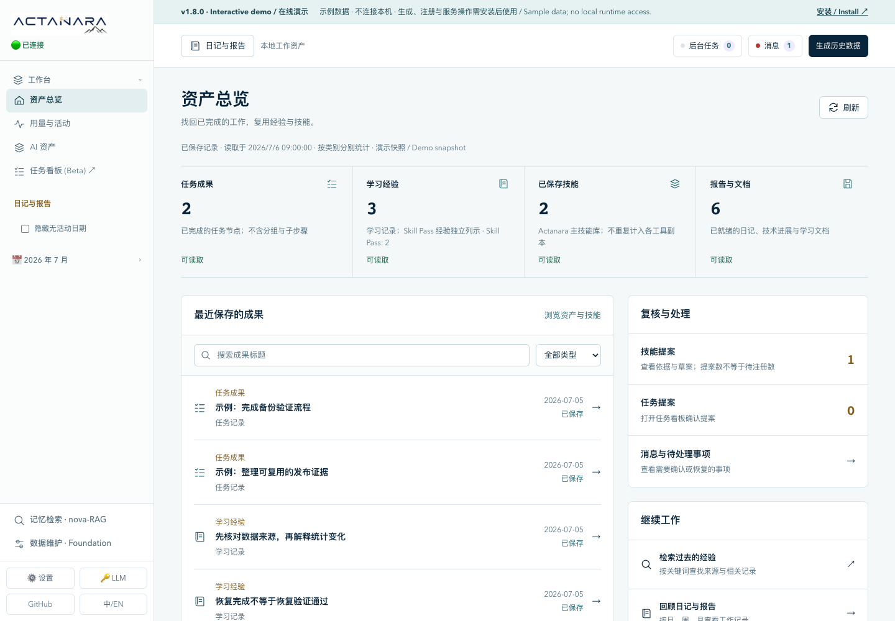

<p align="center">
  <strong>简体中文</strong> · <a href="README.md">English</a>
</p>

<h1 align="center">
  
</h1>

<p align="center">
  <strong>Agent 完成了有价值的工作——Actanara 让这些成果沉淀为持久的本地资产。</strong>
  <br>
  打通 <strong>Claude Code、Cursor、Codex、Gemini CLI、Antigravity、ZCode、Qwen Code、OpenClaw、OpenCode、Hermes、Copilot CLI、Cline、Continue、Aider</strong> 的会话、任务与调试证据，构建跨 Agent 共享记忆与全景工作图谱。
</p>

<p align="center">
  <a href="https://neo-isshin.github.io/actanara/"></a>
  <a href="https://github.com/Neo-Isshin/actanara/releases/latest"></a>
  <a href="https://neo-isshin.github.io/actanara/dashboard-demo/?lang=zh#page-home"></a>
  
  <a href="#linux-support"></a>
  <a href="LICENSE"></a>
  <a href="https://discord.gg/JvJHngZWz"></a>
</p>

<p align="center">
  <a href="https://neo-isshin.github.io/actanara/dashboard-demo/?lang=zh#page-home"><strong>▶️ 体验在线 Dashboard Demo</strong></a> ·
  <a href="#install-actanara"><strong>⚡ 极速安装</strong></a> ·
  <a href="#linux-support"><strong>🐧 Linux 原生支持</strong></a> ·
  <a href="docs/local-operations-runbook.zh-CN.md"><strong>⚙️ 中文运维 Runbook</strong></a>
</p>

<p align="center">
  <a href="https://neo-isshin.github.io/actanara/dashboard-demo/?lang=zh#page-home">
    
  </a>
</p>

<p align="center"><sub><b>v1.9.0 资产优先 Alpine Observatory Dashboard · 演示数据</b> · 点击图片进入在线交互 Demo</sub></p>

> **v1.9.0 更新速览**：全面扩充 Agent Runtime 接入矩阵（新增 ZCode、Qwen Code、Copilot CLI、Cline、Continue、Aider 等），新增只读来源覆盖、会话与产物浏览器。坚持**资产优先**核心：已完成任务、学习经验（Lessons）与技能（Skills）处于中央，Token 统计收归独立「用量与活动」；来源清单绝不冒充已验证任务，保证本地事实库严谨真实。[查看完整版本说明](https://github.com/Neo-Isshin/actanara/releases/tag/v1.9.0)。

---

## 💡 为什么需要 Actanara？

在日常开发中，你可能会在一天之内轮换使用 **Claude Code、Cursor、Codex、Gemini CLI、Antigravity** 等多个 AI 工具。每个 Agent 都在为你排查 Bug、重构模块或验证架构，但 **Session 一旦结束，这些宝贵的思考过程与工程证据就随风散去**：

- **🧠 记忆割裂**：Claude Code 刚排查出的底层网络重试缺陷，切换到 Codex 时必须重新组织语言再解释一遍。
- **⏳ 上下文与证据蒸发**：昨晚调试到深夜的关键错误日志、调用栈与验证 Diff，今天在终端滚动条关闭后踪迹难寻。
- **📋 工单与总结焦虑**：AI 帮你默默完成了数十次精细的代码修复，但你在下班前依然需要翻阅终端历史手动整理日报、周报和 Jira 任务。

**Actanara 为此而生**：它静默解析并标准化各个 Agent Runtime 的活动，将其沉淀为你**掌控的本地事实数据库**，提供跨工具共享记忆、工作图谱提取与自动化工作叙事。

| 场景维度 | 传统模式 (Session 结束即清空) | 使用 Actanara 之后 |
| :--- | :--- | :--- |
| **跨工具协作** | 各 Agent 孤岛运行，上下文无法互通 | 🧠 **共享记忆 (`nova-RAG` / Memory Search)**：让 Codex / Cursor 直接检索 Claude Code 过往的决策与代码证据 |
| **任务与证据** | 依赖开发者人工编写 Task 和 Jira 工单 | 🕸️ **真实工作图谱 (`Nova-Task`)**：从对话、文件变更和工具调用中自动归纳层级任务树 |
| **经验与技能** | 排查过程随会话消失，重复踩坑 | 📚 **本地 AI 资产中心**：沉淀任务成果、排错经验 (Lessons)、可复用技能 (Skills) 与结构化报告 |
| **工作进展总结** | 下班手动回溯命令行与 Git 提交 | 📝 **自动工作叙事**：自动汇总日报、周报与月报，客观反映开发进展与决策轨迹 |
| **数据与隐私** | 担心敏感代码与会话泄露到云端 | 🔒 **100% 本地优先**：所有 SQLite 数据、Markdown 报告与索引均存放于本地，权限受限 |

---

## 🧭 系统架构与数据流

```text
 ┌─────────────────────────────────────────────────────────────────┐
 │          支持的 15+ Agent Runtimes (本地会话、日志与产物)         │
 └────────────────────────────────┬────────────────────────────────┘
                                  │ 归因解析器 (Parsers)
                                  ▼
 ┌─────────────────────────────────────────────────────────────────┐
 │               Foundation 本地事实层 (SQLite / 密钥 / 存根)        │
 └──────────────┬─────────────────┬─────────────────┬──────────────┘
                │                 │                 │
                ▼                 ▼                 ▼
 ┌───────────────────────┐ ┌─────────────┐ ┌───────────────────────┐
 │ Base Pipeline (日记生成)│ │ Nova-Task   │ │ Memory Search / RAG │
 └──────────────┬────────┘ └──────┬──────┘ └────────┬──────────────┘
                │                 │                 │
                └─────────────────┼─────────────────┘
                                  ▼
 ┌─────────────────────────────────────────────────────────────────┐
 │            Actanara Alpine Observatory Web Dashboard            │
 └─────────────────────────────────────────────────────────────────┘
```

---

## 🌟 四大核心支柱

### 1. 📋 Nova-Task：真实发生过的工作图谱

`Nova-Task` 不是又一份普通的待办清单。很多有价值的工作并不从明确的 ticket 开始，而是在排查、修复、试验、回滚和验证中自然生长——它把这些轨迹转换为可审阅、可持续维护的任务结构。

- **自动维护与对账**：自动识别层级、更新状态、挂载子任务并优化任务树；高影响一级节点保留人工审阅，常规更新按规则自动处理，人类随时可以接管。
- **PRD/RFC 智能拆解**：导入 RFC、PRD 或 Roadmap 后，Actanara 能调用 LLM 将其拆解为可迭代、可对账的工程任务树。详见 [Nova-Task 工作图谱对账](docs/nova-task-work-graph-reconciliation.md)。

### 2. 🔎 Memory Search：未部署 RAG 也能检索

`actanara search` 默认使用 `--mode auto`。开箱即用，无需配置复杂的模型环境：

- **词法检索保底 (Lexical Fallback)**：未启用或未就绪 RAG 时，自动切换至增量维护的本地 SQLite 全文索引（FTS5），毫秒级响应，零 API 成本。
- **动态只读 Skill**：安装器仅管理一份动态、只读的 Memory Search Skill，外部 Agent 可通过 Skill 读取元数据并自适应选择词法或语义通道。
- **原生记忆兼容**：默认收录 Codex 与 Claude Code 自身管理的记忆与白名单指令文件，支持独立开关。详见 [Memory Search 与本地 Recall 说明](docs/memory-search.md)。

### 3. 🤖 nova-RAG：受控只读的跨 Agent 语义共享

`nova-RAG` 是 Actanara 的可选语义检索子系统，支持本地 CPU-only 轻量模型或云端 Embedding：

- **确定性与安全边界**：向外部 Agent Runtime 提供**严格只读**的查询能力——外部工具可检索工作记忆，但**绝不能写入记忆、修改索引、更改设置或控制服务生命周期**。
- **两层自适应检索**：服务端先执行确定性的自适应检索，仅在证据弱或歧义时提示外部 Runtime 进一步反思，有效遏制模型幻觉。详见 [nova-RAG 外部 Agent Runtime 合约](docs/rag-external-agent-contract.md)。

### 4. 📦 资产优先的 Alpine Observatory 仪表盘

在 v1.8.0+ / v1.9.0 中，Actanara 带来了全新的 **Alpine Observatory** 设计：

- **资产归集**：集中审阅已完成任务、排错经验（Lessons）、可复用技能（Skills）与正式报告。
- **独立用量与活动**：Token 消耗、消息频次、模型排行与 30 天活跃度独立归集于「用量与活动」板块，科学剔除 Prompt Cache 重复统计，呈现真实账单等价评估。
- **交互演练**：可直接在本地或通过 [在线交互 Demo](https://neo-isshin.github.io/actanara/dashboard-demo/?lang=zh#page-home) 体验完整界面。

---

<a id="install-actanara"></a>
## ⚡ 安装与快速开始

### 1. 一键安全安装

在 macOS 或 Linux 终端中运行公开入口脚本（无需 `sudo`）：

```bash
curl -fsSL https://github.com/Neo-Isshin/actanara/releases/latest/download/install.sh | sh
```

这是 macOS 与 Linux 共用的官方公开入口。GitHub 从最新稳定且不可变的 Release 提供该入口；构件已固定到该 Release 的精确源码 commit，再分派到对应平台适配器。macOS 保持原有的引导式全新安装与更新行为；Linux 支持受保护的全新安装、仅源码刷新、按锁升级，以及经明确确认的已有 Runtime 修复。Linux 更新事务会保持原有 systemd user unit 状态，遇到定义漂移或非 Actanara unit 时保守失败。第一次了解 Actanara？可以先体验 [在线 Dashboard Demo](https://neo-isshin.github.io/actanara/dashboard-demo/?lang=zh#page-home)，再决定是否安装。

Linux 公开入口发现已有 managed Runtime 时：存在控制终端会先展示固定到精确 commit 的升级计划，再询问是否执行；没有控制终端则以状态码 2 退出、不改动 Runtime，并输出可直接复制的 `actanara update --dry-run` 与 `actanara update --apply` 精确命令，其中包含已解析的源码 URL、commit、Runtime 与 installer cache。

稳定 CLI shim 为 `~/.actanara/bin/actanara`，默认还会建立 `~/.local/bin/actanara` 链接。macOS 可用 `--no-shell-path` 或 `--shell-path-file /path/to/profile` 控制受管理的 profile 区块；Linux 的 `--no-shell-path` 只禁止 user-bin 链接，安装器不会编辑 Shell profile。高级源码选择使用 `--source-root PATH` 或精确 `--ref <full-commit-sha>`；离线操作必须明确选择其中一种来源。

安装器写入路径以及 launchd/systemd 注册边界见 [中文本地操作 Runbook](docs/local-operations-runbook.zh-CN.md)。

### 2. 基础验证与启动

安装完成后，执行以下只读验证命令（不修改任何系统设置）：

```bash
actanara doctor
actanara onboard status
```

然后在浏览器中打开 Dashboard（默认地址 `http://127.0.0.1:3036/dashboard`）：
1. **配置 Provider**：在设置中配置你的 LLM Provider 与 API Key（支持 OpenAI、Anthropic、Gemini 或兼容中转服务），完成连通性测试。
2. **扫描与沉淀**：Actanara 会自动发现本地已有会话，生成首批工程日记、Nova-Task 工作图谱与知识资产。

<details>
<summary><strong>🛠️ 高频 CLI 指令速查</strong></summary>

```bash
# 自动搜索记忆（优先使用已就绪的 nova-RAG，否则自动使用本地词法索引）
actanara search "redis connection timeout fix" --top-k 5

# 显式指定检索模式
actanara search "deployment failure" --mode rag --json
actanara search "deployment failure" --mode local --json

# 检查或重建本地 SQLite 全文索引
actanara memory status
actanara memory sync
actanara memory rebuild

# 手动触发指定日期的工作日记与资产生成
actanara pipeline
actanara pipeline 2026-07-12

# 检查系统更新或应用升级
actanara update --dry-run
actanara update --apply
```

更新器在依赖一致时复用 venv、否则从带 hash 的 lock 重建；venv 复用、`--source-only/--force-rebuild/--offline`、源码获取与 commit 固定等细节，见 Runbook 的「更新」一节。Actanara 暂未提供一键卸载器，请勿直接删除 `~/.actanara`，正确卸载步骤见 Runbook「卸载边界」一节。

Linux 上显式使用 `--source-url` 或 `--ref` 时，邻接 bootstrap 文件只作为执行入口，不会被当成所选源码。installer cache 中规范化后的 Git `origin` 以及精确 fetched/cached commit 会在在线、离线模式下都先完成校验，之后才运行安装器。

Linux 常规更新要求 Actanara 管理的 systemd 定义已对齐，并逐个保持 unit 原有 enabled/active 状态。若可信 Runtime 配置或受管理定义发生漂移，请按 Runbook 使用需明确确认的 repair；repair 不会接管或删除用户自有 unit。

</details>

---

<a id="linux-support"></a>
## 🐧 Linux 支持

Actanara 为使用 `systemd --user` 的 Debian 类主机提供原生、非 root 的 Linux 路径，并不是 macOS 兼容层。当前发布门禁在 Debian 13 x86_64、CPython 3.13 与 systemd 257 上执行；依赖锁也提供 arm64 目标，而真实主机功能门禁覆盖的是 x86_64。

| 能力领域 | Linux 生产级行为 |
| :--- | :--- |
| **安装与升级** | 公开 Release `install.sh` 入口支持受保护全新安装、精确 ref / 源码刷新、按锁依赖升级和原子修复。新 generation 先在 staging 中构建再原子切换；失败后旧 Runtime 毫秒级恢复。 |
| **服务管控** | 请以普通登录用户执行安装，**严禁通过 `sudo` 运行**。Dashboard、可选 `nova-RAG` 与定时调度服务均由 `systemctl --user` 托管。 |
| **RAG 离线 Profile** | 全新安装可启用经审计的 CPU-only 本地 profile（基于 `intfloat/multilingual-e5-small`）。未配置 Provider 凭证时，托管云端 RAG 保守拒绝。 |
| **远程与无桌面主机** | Dashboard 与 RAG 默认绑定 `127.0.0.1`（端口 3036 / 3037）。远程服务器建议通过 SSH 端口转发无缝访问： |

```bash
# 无桌面服务器端口转发示例
ssh -N -L 3036:127.0.0.1:3036 user@linux-host
# 随后在本地浏览器访问 http://127.0.0.1:3036/dashboard
```

---

## 🔐 隐私与安全承诺

- **100% 本地优先**：所有 Runtime 状态、SQLite 数据库、Markdown 日记与 Vector 索引均保存在你掌控的本地磁盘路径。
- **密钥物理加固**：Provider API Key 存放在 `$ACTANARA_HOME/state/secrets`，严格施加目录 `0700`、文件 `0600` 的 POSIX 权限隔离。
- **非侵入式架构**：Actanara 仅只读解析受支持工具已落盘的日志，**绝不改写外部 Runtime 的历史数据，也绝不接管其运行时进程**。
- **只读回环外部接口**：通用外部记忆查询接口 `/api/memory/external/*` 仅允许本机回环（Loopback）访问；外部原生记忆收集严格遵循白名单清单。

---

## 📐 开发、测试与可复现发布

<details>
<summary><strong>展开开发与测试命令</strong></summary>

创建本地可编辑开发环境：

```bash
python3 -m venv .venv
source .venv/bin/activate
python -m pip install --upgrade pip
python -m pip install -e ".[dashboard,rag-local]"
```

在隔离的 venv、`HOME`、`ACTANARA_HOME` 和固定业务时钟中运行发布测试集：

```bash
python tests/run_isolated_release_suite.py
```

运行确定性的前端与 Release Page 测试：

```bash
npm ci
node --check src/dashboard/app/static/js/app.js
npm run test:dashboard-live-context
npm run test:release-page
```

复现当前 checkout 的发布构件：

```bash
python -B -m pip install -r requirements-release.txt
PROJECT_VERSION="$(python -c 'import tomllib; print(tomllib.load(open("pyproject.toml", "rb"))["project"]["version"])')"
SOURCE_DATE_EPOCH="$(git show -s --format=%ct HEAD)" \
python -B -m tools.release.build_release \
  --source-root . \
  --output-dir ../actanara-release-artifacts \
  --expected-commit "$(git rev-parse HEAD)" \
  --expected-version "$PROJECT_VERSION"
```

发布构建器只接受干净、已提交的 Git 工作树，并把输出写到仓库外。制品包括源码与 Runtime payload manifest、归一化归档、wheel、sdist、provenance 和 `SHA256SUMS`。

</details>

---

<a id="documentation"></a>
## 📚 完整文档导航

### 用户与日常操作
- ⚙️ [中文本地操作与运维 Runbook](docs/local-operations-runbook.zh-CN.md) —— 详细参数、LaunchAgent/Systemd 运维与故障排查
- 📖 [新用户安装手册](docs/new-user-onboarding-runbook.zh-CN.md) —— 从零开始配置 LLM 与数据回填指南
- 🧭 [CLI 产品边界说明](docs/cli-boundary.md) —— CLI 指令集与系统边界定义
- 🔎 [Memory Search 与本地 Recall 说明](docs/memory-search.md) —— 本地与语义检索混合策略

### 集成与架构设计
- 🤖 [nova-RAG 外部 Agent 接入合约](docs/rag-external-agent-contract.md) —— API 规范与只读调用模式
- 🧩 [Nova-Task 工作图谱对账机制](docs/nova-task-work-graph-reconciliation.md) —— 任务自动归纳与对账设计原理

### 质量保证与项目演进
- ✅ [发布保证归档](docs/v1-release-assurance.md) · 🧹 [发布清理清单](docs/production-clean-inventory.md)
- 🧾 [更新日志 (Changelog)](CHANGELOG.md) · 🔐 [安全策略](SECURITY.md) · 🕰️ [公开项目历史](HISTORY.md)

---

## ⚖️ 许可证与致谢

Copyright © 2026 Neo-Isshin.

本项目采用 [MIT 许可证](LICENSE)，SPDX 标识为 `MIT`。

- 感谢各大 AI 编程工具（Claude Code, Cursor, Codex, Gemini CLI, Antigravity, OpenClaw 等）将活动日志规范保存在本地，使得统一可视化与资产沉淀成为可能。
- 感谢 [getdesign.md](https://getdesign.md) 社区为 Dashboard 视觉风格提供的灵感。

<hr>

<a id="give-star"></a>
<div align="center">

<h2>⭐ Give me a Star</h2>

<p>
如果 Actanara 帮助你把分散的 AI 工作沉淀为可检索、可复用的本地资产，<br>
欢迎在 GitHub 点亮一颗 Star，支持项目的持续演进！
</p>

<a href="https://github.com/Neo-Isshin/actanara">
  
</a>

</div>
