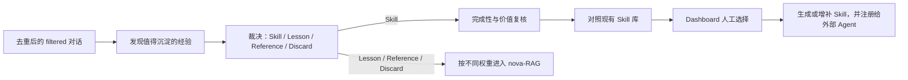

# Skill Pass 流程

- Base Pipeline 只生成候选与检索资产，不自动扩张外部 Agent 的 Skill 库。
- Skill 必须经过 Dashboard 中的用户选择后才会生成或增补并注册。
- Lesson、Reference、Discard 保留为可检索经验，但不被视为独立事实权威。
- 基础设施、运行服务与当日产物不属于这条链路，后续由 Technical Pass 单独整理。
